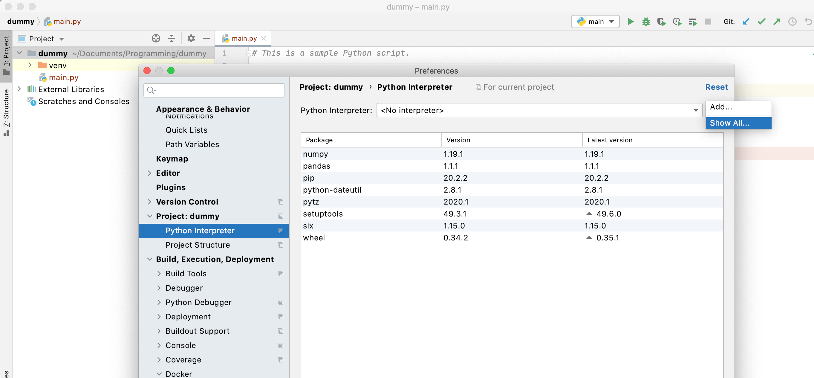
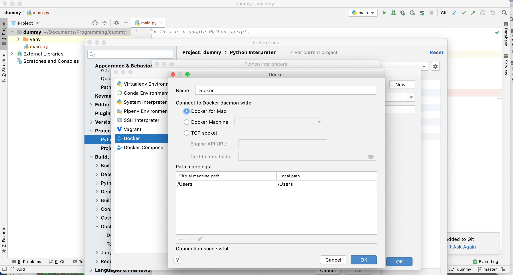
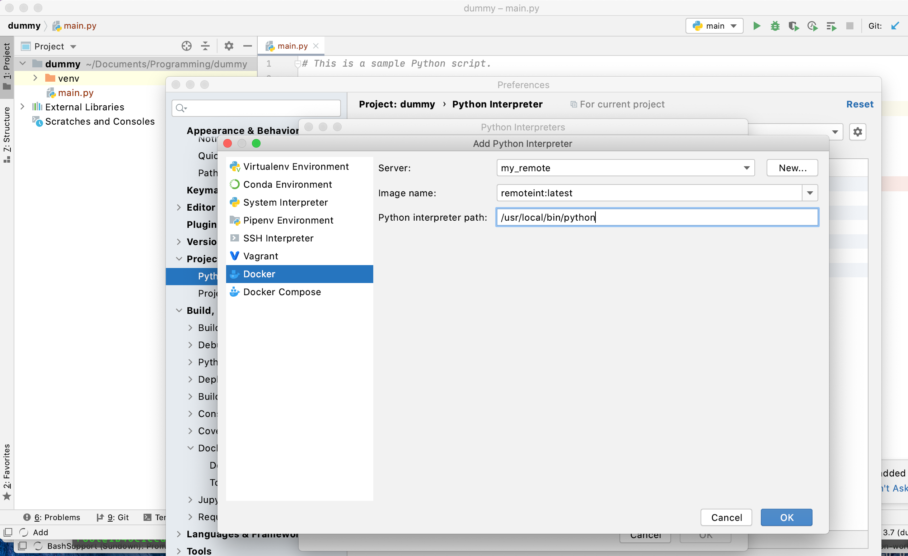
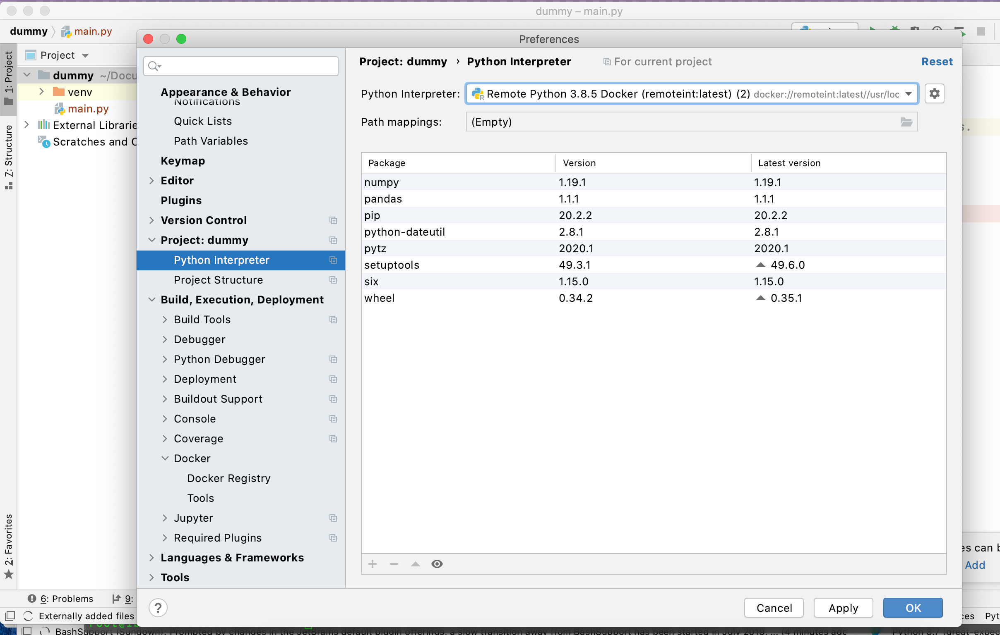

# use remote interpreter in a docker from pycharm

# steps:
1. `docker build -t remoteint .`
2. `docker run -it remoteint`
3. start pycharm:
- add interpreter

- choose a `docker` type interpreter 

- enter the correct python executable path in the container. if not sure, try run the container interactively with `bash` and do `which python`

- voila!

